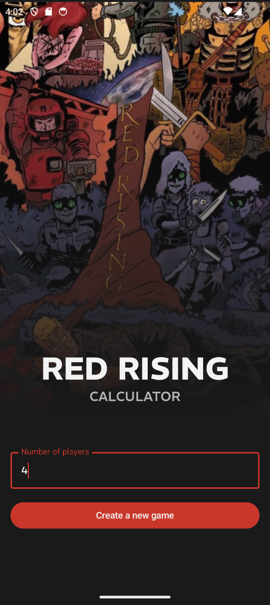
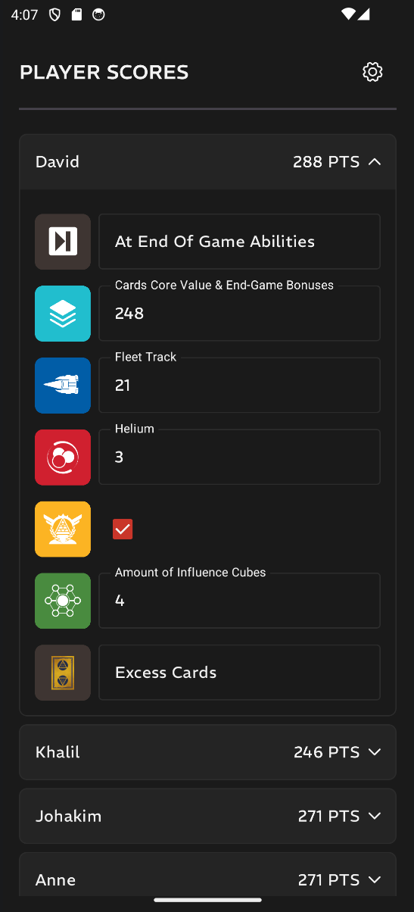
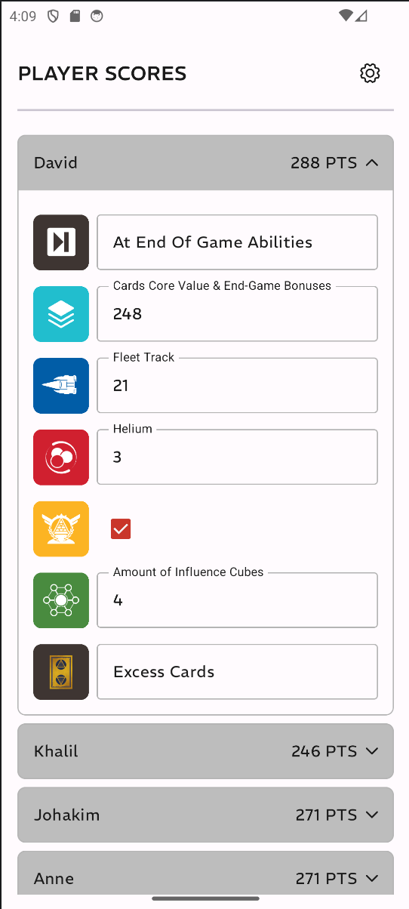

# Red Rising Calculator

A score calculator for the [Red Rising](https://stonemaiergames.com/games/red-rising/) board game by Stonemaier Games. Track scores across multiple players with support for all scoring categories including character cards, fleet track, helium, influence rankings, sovereignty tokens, and more.

Built as a native Android app with a clean, modern UI supporting both light and dark themes.






## Architecture

- **UI:** Jetpack Compose (Material 3)
- **Architecture:** MVVM
- **Min SDK:** 26 (Android 8.0)
- **Target SDK:** 35

A potential improvement is adding a database of all cards and their values, so the app can automatically calculate points.

## Building & Running

1. Clone the repository:
   ```bash
   git clone https://github.com/your-username/BoardGamesCalculator.git
   ```
2. Open the project in Android Studio.
3. Sync Gradle when prompted.
4. Run on an emulator or physical device (Android 8.0+).

To build a release APK:
- **Linux/macOS:** `./gradlew assembleRelease`
- **Windows:** `gradlew.bat assembleRelease`

## License

This project is licensed under the Apache License 2.0. See [LICENSE](LICENSE) for details.
